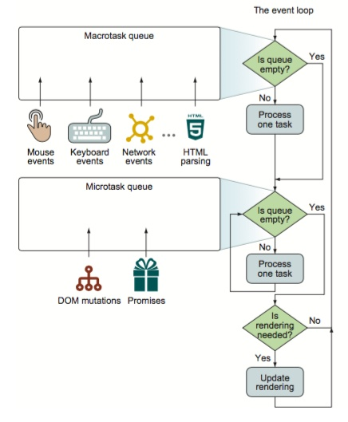

### Macrotask 与 Microtask 都属于异步任务中的一种
```
  Microtask: Promise, process.nextTick, MutationObserver
  Macrotask: setTimeout, setInterval, setImmediate, I/O, UI rendering
```
Macrotask包括: 生成DOM对象， 解析HTML, 执行主线程js代码， 更改当前URL还有其它的一些事件页面加载、输入、网络事件和定时器事件等。

Microtask包括: 处理Promise的回调和DOM修改等
```
  console.log('script start');
  setTimeout(function () {
    console.log('setTimeout);
  }, 0);
  Promise.resolve().then(() => {
    console.log('promise1');
  }).then(() => {
    console.log('promise2');
  });
  console.log('script end');
```
运行结果:
```
  script start
  script end
  promise1
  promise2
  setTimeout
```

### 原因:
  异步任务为人Microtask(微任务)和Macrotask(宏任务)， 而Promise中的then被推入到Microtask队列，而setTimeout被推入到Macrotask队列。 <b>在每一次事件循环中，macrotask只会提取一个执行，而microtask会一直提取，直到microtask队列清空</b>

  注: <b>一般情况下， macrotask queues 直接称为 task queues, 只有microtask queues 才会特别指明。</b>

  另: 事件循环每次只会入栈一个macrotask, 主线程执行完该任务后又会先检查microtask队列并完成里面的所有任务后再执行macrotask;

### microtask实现库
```
  immediate库是一个跨浏览器的 microtask 实现。
```